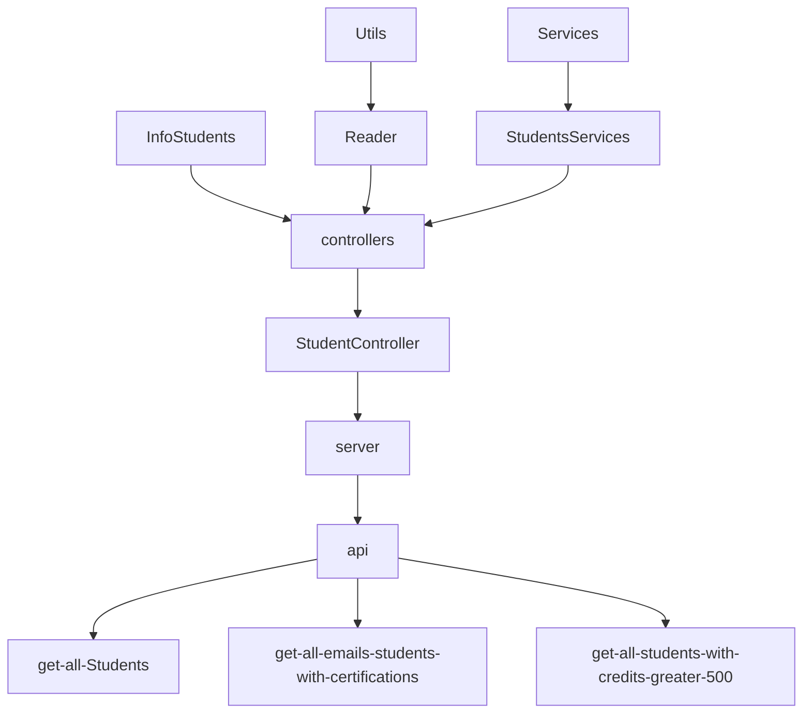

# Code Challenge

## Descripcion

 - Proyecto realizado, para la mision backend node de LaunchX Semana 4.

 - Mision Impartida por el Mission Comander Carlo Gilmar.

## Dependencias 

 - `@types/jest`: Autocompleta metodos de jest en vscode.

 - `eslint`: Permite darle formato a nuestro codigo.

 - `jest`: Nos brinda un entorno para hacer pruebas unitarias.

 - `express`: Framework de javascript enfocado al backend.
 
## Comandos

- `test`: Nos permite ejecutar las pruebas unitarias con la dependencia de jest.
 
- `test-w`: Nos permite ejecutar las pruebas unitarias sin salirnos del entorno de pruebas de jest.
 
- `linter`: Nos permite detectar las insconsitencias del formato de codigo con eslint.

- `linter-fix`: Nos permite reparar las inconsitencias del formato del codigo con eslint.
  
## Diseño de componentes

**Reader**

 - Importe el module fs.
 - Posteriomente creé la clase del reader con el metodo readFile con static donde le pasamos el parametro filePath. 
 - Usé existsSync que viene en el modulo fs, para verificar si existe cierta ruta y nos retorna un booleano.
 - Al final use readFileSync que viene en el modulo fs, para poder leer el archivo, posteriormente lo tranforma a un valor prooducido por el análisis.

  ```javascript 
    const fs = require("fs");

    class Reader{

        static readFile(filePath){
            if(!fs.existsSync(filePath))
                return "The file does not exists.";
            const rawData = fs.readFileSync(filePath);
            return JSON.parse(rawData);
        }

    }

    module.exports = Reader;
 ```
**StudentService Class**
 
 *getStudents*

 - Tenemos el parametro `students`, que nos regresara un error o todos los estudiantes con sus respectivas propiedades.
 
 *getEmailsStudentsWithCertification*

 - Utilizaremos la propiedad `getStudents` para obtener todos los estudiantes con sus datos posteriormente los filtraremos con el metodo `filter`, donde el `student` contenga `true` en la propiedad `student.haveCertification`.

 - Posteriomente crearemos un array que retornaremos como respuesta con `map` donde solo restornaremos la propiedad `student.email`.

 ```javascript
    static getEmailsStudentsWithCertification(students){

        const allStudents = this.getStudents(students);
        const filterStudentsByEmail = allStudents.filter(student => student.haveCertification );
        const emailsStudents = filterStudentsByEmail.map(student => student.email);
        return emailsStudents;

    }
 ```
 *getStudentsByCreditsGreater500*

 - Utilizaremos la propiedad `getStudents` para obtener todos los estudiantes con sus datos posteriormente los filtraremos con el metodo `filter`, donde el `student` `credits` sea mayor a `500` en la propiedad `student.credits` y lo retornaremos.

 ```javascript
    static getStudentsByCreditsGreater500(students){

        const allStudents = this.getStudents(students);
        const filterStudentsByCreditsGreater500 = allStudents.filter(student => student.credits>500);
        return filterStudentsByCreditsGreater500;

    }
 ```

 **StudentsController Class**

 - En estas funciones solo conectamos los metodos de los `studentsServices` con su respectivo metodo, ademas de usar `Reader.readFile` para leer el JSON de la informacion de Visual Partnership.
 
 ```javascript
    static getStudents(){

        const students = Reader.readFile(process.cwd()+"/data/visualPartnershipStudents.json");
        return StudentsService.getStudents(students);

    }

    static getEmailsStudentsWithCertification(){

        const students = Reader.readFile(process.cwd()+"/data/visualPartnershipStudents.json");
        return StudentsService.getEmailsStudentsWithCertification(students);

    }

    static getStudentsByCreditsGreater500(){

        const students = Reader.readFile(process.cwd()+"/data/visualPartnershipStudents.json");
        return StudentsService.getStudentsByCreditsGreater500(students);

    }
 ```

## Referencia de la api
#### Consultar todos los estudiantes.

```http
  GET /v1/students/
```

*Ejemplo de Respuesta*

```javascript
[
    {
        id: "6264d5d89f1df827eb84bb23",
        name: "Warren",
        email: "Todd@visualpartnership.xyz",
        credits: 508,
        enrollments: [
        "Visual Thinking Intermedio",
        "Visual Thinking Avanzado"
        ],
        previousCourses: 1,
        haveCertification: true
    }
,
    {
        id: "6264d5d85cf81c496446b67f",
        name: "Lucinda",
        email: "Sexton@visualpartnership.xyz",
        credits: 677,
        enrollments: [
        "Visual Thinking Avanzado"
        ],
        previousCourses: 6,
        haveCertification: true
    }
,
    {
        id: "6264d5d8cda17de0d2e9f236",
        name: "Fuentes",
        email: "Sharlene@visualpartnership.xyz",
        credits: 210,
        enrollments: [
        "Visual Thinking Avanzado"
        ],
        previousCourses: 10,
        haveCertification: true
    }
,
    {
        id: "6264d5d8878a117a9c57c5c4",
        name: "Claudia",
        email: "Howell@visualpartnership.xyz",
        credits: 227,
        enrollments: [
        "Visual Thinking Avanzado"
        ],
        previousCourses: 5,
        haveCertification: true
    }
,
    {
        id: "6264d5d8dd1a0be4e249c662",
        name: "Phillips",
        email: "Camacho@visualpartnership.xyz",
        credits: 973,
        enrollments: [
        "Visual Thinking Intermedio"
        ],
        previousCourses: 8,
        haveCertification: false
    }
]
```
#### Consultar todos los emails de los estudiantes que cuenten con la certificaion.

```http
  GET /v1/students/emails
```

*Ejemplo de Respuesta*

```javascript
[
    "Todd@visualpartnership.xyz",
    "Sexton@visualpartnership.xyz",
    "Sharlene@visualpartnership.xyz",
    "Howell@visualpartnership.xyz",
    "Haynes@visualpartnership.xyz",
    "Montoya@visualpartnership.xyz",
    "Benton@visualpartnership.xyz",
    "Dionne@visualpartnership.xyz",
    "Mcpherson@visualpartnership.xyz",
    "Gracie@visualpartnership.xyz",
    "Ila@visualpartnership.xyz",
    "Dorthy@visualpartnership.xyz",
    "Mcfarland@visualpartnership.xyz",
    "Maryann@visualpartnership.xyz",
]
```
#### Consultar todos los estudiantes que cuenten con creditos mayores a 500.

```http
  GET /v1/students/credits
```

*Ejemplo de Respuesta*


 ```javascript
[
    {
        id: "6264d5d89f1df827eb84bb23",
        name: "Warren",
        email: "Todd@visualpartnership.xyz",
        credits: 508,
        enrollments: [
            "Visual Thinking Intermedio",
            "Visual Thinking Avanzado"
        ],
        previousCourses: 1,
        haveCertification: true
    },
    {
        id: "6264d5d85cf81c496446b67f",
        name: "Lucinda",
        email: "Sexton@visualpartnership.xyz",
        credits: 677,
        enrollments: [
            "Visual Thinking Avanzado"
        ],
        previousCourses: 6,
        haveCertification: true
    },
    {
        id: "6264d5d8dd1a0be4e249c662",
        name: "Phillips",
        email: "Camacho@visualpartnership.xyz",
        credits: 973,
        enrollments: [
            "Visual Thinking Intermedio"
        ],
        previousCourses: 8,
        haveCertification: false
    },
    {
        id: "6264d5d8dd01ab97ddedbba5",
        name: "Taylor",
        email: "Haynes@visualpartnership.xyz",
        credits: 652,
        enrollments: [
            "Visual Thinking Avanzado"
        ],
        previousCourses: 5,
        haveCertification: true
    },
    {
        id: "6264d5d89d03e25451f124e5",
        name: "Mindy",
        email: "Alfreda@visualpartnership.xyz",
        credits: 830,
        enrollments: [
            "Visual Thinking Intermedio",
            "Visual Thinking Avanzado"
        ],
        previousCourses: 9,
        haveCertification: false
    },
    {
        id: "6264d5d82c0b4c7dfb0b6ad5",
        name: "Kara",
        email: "Simon@visualpartnership.xyz",
        credits: 833,
        enrollments: [
            "Visual Thinking Avanzado"
        ],
        previousCourses: 8,
        haveCertification: false
    },
];
 ```
## Diseño


## Autor 
[roblesvargas97](https://github.com/roblesvargas97)

